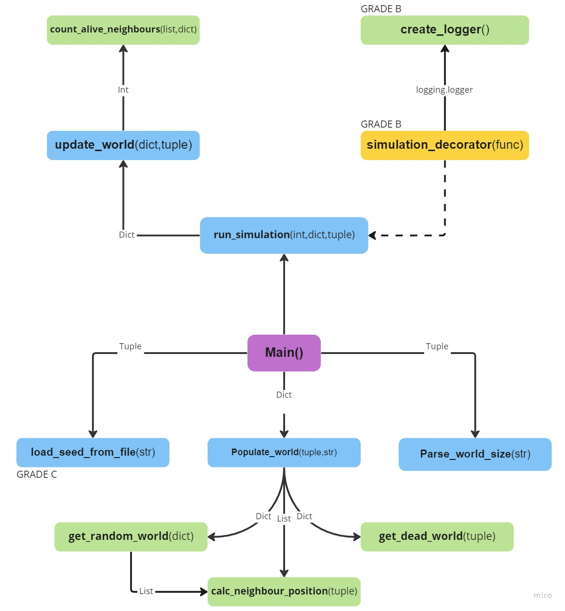
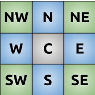
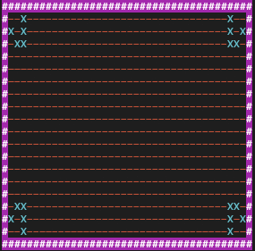
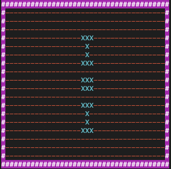
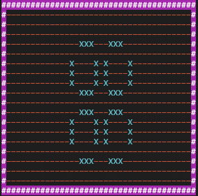
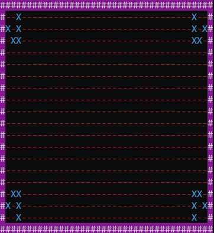
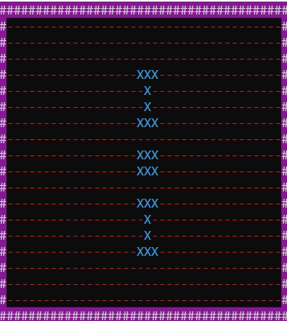
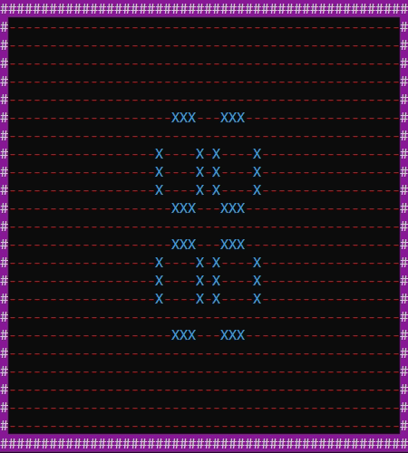
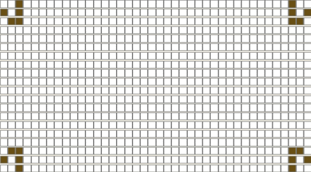

# Project

## Utvecklingsmiljö & verktyg

Hjälpmedel som användes för att implementera detta projekt

* Windows 11 på en hp laptop
* PyCharm 2022.2.1 (Professional Edition)
* Python version 3.10.6
* cmd

## Syfte

Syftet med detta projekt är att finna en sekvens av instruktioner som tillåter automation av en specifik uppgift. I detta fall var målet att implementera en sekvens som representerar den cellulära automationen **Game of Life**, där den implementerade sekvensen ska förhålla sig till de regler och lagar som finns i GoL. Detta löses genom att tillämpa lösningar till ett antal fördefinierade funktioner med hjälp av filen **code_base.py** som innehåller  kod för bland annat utskrift till terminal.
Programmet ska även skriva viss information till specifik fil genom användning av loggning.

Korrekt implementerad program kräver följande egenskaper

1. Korrekt funktionalitet vad gäller simulering av olika typer av mönster både vad gäller `-s` samt `-f` argumenten.
2. Korrekt hantering av felaktiga argument för att programmet ska fungera som förväntat.
3. Korrekt loggning av simulation till specifik fil för att få en överblick över världens alla celler.
4. Korrekt åldring av celler där celler som överlever 5 generationer omvandlas till `elder`, celler som överlever 11 generationer omvandlas från elder till `prime`.


## Genomförande
Nedan ska genomförandet utav implementationen beskrivas där egenskaperna som nämndes i sektionen ovan strävas efter, detta så att läsaren kan återskapa samma resultat vid senare tillfälle. Tanken är att läsaren får förståelse för var och en av funktionerna nedan, ett flödesschema på den färdiga implementationen av projektet presenteras nedan, detta ger en överblick av hur den färdiga implementationen bör se ut.


<p style="text-align:center; margin: 50px;"> </p>


### Betyg E: Basimplementation

#### **parse_world_size_arg(_arg: str) -> tuple**

Denna funktions syfte är att göra kontroller samt omvandla argumentet till korrekta datatyper, funktionens mål är att returnera en tupel med **bas**, **höjd**  
argumentet som förväntas av denna funktion är **bas x höjd** exempelvis **40x20**.  
För att implementera en fungerande lösning behöver ett par frågor ställas:

* Är argumentet korrekt? om inte hur ska detta behandlas?
* Hur kan argumentet delas upp och behandlas?
  

Till en början kan funktionen kapslas in i ett try-except block, detta betyder att programmet försöker utföra en sekvens instruktioner där vissa typer av fel uppmärksammas, i detta fall är **AssertionError** samt **ValueError** de intressanta felen programmet kan stöta på. Om programmet stöter på just dessa fel ska programmet behandla dessa på ett speciellt sätt.  

För att dela upp argumentet kan detta göras med hjälp av en **generator expression**, enligt uppgiftspecifikationen ska fuktionen returnera en tupel av heltal ex: **(40, 80)**. Med hjälp av generator expression kan detta åstakommas på ett elegant och effektift sätt, nedan beskrivs hur detta går till  

_arg splittas först upp där 'x' är bokstaven där det ska splittas 40x20 blir då en lista med två värden ['40', '20'] problemet som kan uppstå är att tomma strängar kommer med i listan, ex: '30x' vilket blir en lista med 2 objekt ['30', ''] Detta är inte bra för senare kontroller så denna tomma sträng behöver tas bort vilket kan göras med en if selektion. Då listor och tupels kan konverteras till och från varandra direkt kan detta omvandlas direkt. Dessa datatyper kan itereras över och detta kan åstakommas med en `for` loop.
```py
arguments = tuple(x for x in _arg.split('x') if x != "")
```
Detta funkar bra, men det är fortfarande enbart strängar som arbetas med. Som tur är går det också bra att omvandla strängar till integer om det är möjligt att representera strängen som int ex: '40' kan representeras som heltalet 40 medans 'df' inte kan omvandlas då det innehåller bokstäver, programmet kommer då lyfta ett ValueError. Det kan även vara bra att kontrollera hur många 'x' som finns i strängen med hjälp av den inbyggda `count` funktionen. Detta eftersom programmet inte längre bryr sig om tomma strängar vilket betyder att ett argument som `40x20x` skulle anses som `40x20` för programmet, men `40x20x` är ju inte ett korrekt argument.

```py
arguments = tuple(int(x) for x in _arg.split('x') if x != "" and _arg.count('x') <= 1)
```

I pseudokoden var det krav att ett Assertmeddelande skrivs ut om antalet värden är felaktigt, detta kan göras med `assert`. Assertion kan anses som 'om inte test: lyft AssertionError' vilket gör det simpelt att förstå. assert len(arguments) == 2 betyder helt enkelt *om längden på argumentet inte är 2, lyft felmeddelande* eftersom programmet enbart ska jobba med x och y koordinater bör argumentet inte innehålla fler än 2 objekt. Som tidigare beskrivits är nu argumenten en tupel med förhoppningsvis 2 heltalsvärden.
&nbsp;  
&nbsp;  
#### **run_simulation(_generations: int, _population: dict, _world_size: tuple)**  


**Beskrivning**:

I enlighet med pseudokoden kan denna funktion implementeras med hjälp av en `for` som loopar för varje generation. För att sedan anropa `cb.clear_console()` vilket rensar terminalfönstret. För att den uppdaterade världen ska lagras korrekt kan `_population = update_world(_population,_world_size)` användas, detta tillåter _population att uppdateras korrekt inför nästa uppdatering. Slutligen ska programmet sova i 200 millisekunder, detta för att världen inte ska uppdatera alltför fort.


#### **populate_world(_world_size: tuple, _seed_pattern: str = None) -> dict:**  

Med hjälp av `itertools.product` kan alla celler i världen skapas som tupel av dess koordinat, då världens storlek är en tupel av höjd x bas kan dessa itereras över med hjälp av `range`, med hjälp av **list comprehension** kan detta göras på en rad.

```py
cells = [(x, y) for y,x in itertools.product(range(_world_size[1]),range(_world_size[0]))]
```
Om argumentet i _seed_pattern är något utav 'gliders', 'penta' eller 'pulsar' ska en funktion i code_base(cb) anropas, denna funktion är `get_pattern()` detta kommer returnera en lista med koordinater för vilka levande celler har för koordinat. Dessa koordinater är dock omvända (höjd, bas) vilket gör att de måste kastas om, som tur är går detta att göra med slicing. Om funktionen returnerar None så ska världen slumpas fram med hjälp av random.randint().

Först skapas en variabel som innehåller värdet returnerat från funktionen cb.get_pattern()

```python
get_pattern = cb.get_pattern(_seed_pattern,_world_size)
```

Denna variabel innehåller nu antingen en lista med koordinater för levande celler eller None, men cellerna är i omvänd ordning (y, x) så dessa behöver vändas på.
Detta betyder att det måste tas i beakt vad som variabeln get_pattern innehåller. Innehåller den None och programmet ska försöka iterera över den blir det ett problem, nämligen ett TypeError som säger att NoneType objekt inte kan itereras. Med hjälp av en kombination av list comprehension samt ternary expression kan detta lösas

```py
pattern = [x[::-1] for x in get_pattern] if get_pattern is not None else get_pattern
```

Detta sparar några rader kod men man kan anse att läsbarheten försämras, en alternativ approach till detta vore

```python
if get_pattern is None:
    pattern = None
else:
    pattern = [x[::-1] for x in get_pattern]
```

Dessa gör samma sak där ena är svårare att läsa men sparar 3 rader av kod medans den andra är mer läsbar men kräver extra kodrader.
I detta fall kan en enkel kommentar skrivas ovanför den mer otydliga approachen för att beskriva vad som sker.

här gås varje cell och sparas i en ny variabel pattern, men dessa sparas omvänd (bas, höjd).

Sedan behövs kontroller på varje cell, en for loop är perfekt för detta, om cellen är från början eller på slutet av världsstorleken ska dessa vara rimceller. Om cellen finns i pattern ska denna cell vara levande. Då läggs cellen till som key i den nyskapade dictionaryn 'population' och värdet på denna är `{'state': cb.STATE_ALIVE, 'neighbours': calc_neighbour_positions(cell)}`, om cellen inte finns med i pattern ska denna vara död. `{'state': cb.STATE_DEAD, 'neighbours': calc_neighbour_positions(cell)}`.

Om pattern inte finns ska världen skapas slumpmässigt. Samma princip gäller men då lever cellen endast om `random.randint(0, 20)` är större än 16.


#### **def get_random_world(_world_: dict) -> dict**  

Detta är en egenimplementerad funktion för senare betyggraden A, detta för att dela upp koden lite och få en mer välstrukturerad kod. Denna funktion skapar den slumpmässiga världen som används i populate_world(), där en värld i form av dictionary inkommer som argument, därefter itereras alla celler och värden igenom med hjälp av .items, items används för att få nycklar samt dess värde. Slumpen avgör om cellen är levande eller inte som tidigare nämnts i sektionen innan.

#### **def get_dead_world(_world_size: tuple) -> dict**

Även denna är en egenimplementerad funktion för senare betyggraden A, detta för att inte göra populate world alltför stor med för mycket kod. Denna funktion skapar en värld utifrån en angiven storlek på världen. Denna funktion skapar rimcellerna samt resterande celler är döda celler, detta returneras sedan och används i både populate_world() samt get_random_world().

#### **update_world(_cur_gen: dict, _world_size: tuple) -> dict**

Denna funktion updaterar världen och skriver ut den till konsolen. Den uppdaterade världen hämtas från `get_updated_world`.

#### **def get_updated_world(_cur_gen: dict, _world_size: tuple) -> dict**

Detta är en egenskriven funktion för uppdatering av värld, detta fungerar på samma sätt som populate world men cellens nästa tillstånd beror på GoL reglerna nedan

* Any live cell with two or three live neighbours survives.  
* Any dead cell with three live neighbours becomes a live cell.  
* All other live cells die in the next generation. Similarly, all other dead cells stay dead.  

Dessa kontroller görs med hjälp av funktionen `count_alive_neighbours` som beräknar grannarnas tillstånd för cellen.  


#### **calc_neighbour_positions(_cell_coord: tuple) -> list**

Denna funktions syfte är att få ut en specifik cells alla 8 grannar, bild på detta nedan. Detta kan åstakommas på flera vis, ett sätt är att ta cellens koordinater x,y och addera/subtrahera 1 till de ex: [(x -1, y-1), (x-1,y), (x-1, y+1), (x, y-1), (x, y+1), (x+1, y), (x+1,y+1), (x-1,y+1)] det går även att göra en list comprehension med två for loopar som itererar över -1,0,1 men exkluderar sin egna cell koordinat då den inte kan vara granne med sig själv ex:  
`[(s + x, k + y) for s in [-1, 0, 1] for k in [-1, 0, 1] if (s + x, k + y) != _cell_coord]`

Men dessa tillvägagångssätt är otydliga och kan skapa förvirring för den som läser koden senare i framtiden. För att få en bättre läsbarhet kan detta skivas som nedan

```python
def calc_neighbour_positions(_cell_coord: tuple) -> list:
    """ Calculate neighbouring cell coordinates in all directions (cardinal + diagonal).
    Returns list of tuples. """
    x, y = _cell_coord
    offset = (-1, 0, 1)
    neighbour_list = []
    for x_offset, y_offset in itertools.product(offset, repeat=2):
        if (x + x_offset, y + y_offset) == (x, y):
            continue
        neighbour_list.append((x + x_offset, y + y_offset))
    return neighbour_list
```

Vad detta gör är att använda sig av itertools.product() för att iterera över variabeln offset, detta sker två gånger. Detta kan ses som `itertools.product(offset, offset)` vilket är ett annat sätt att skriva det på. Om (x + x_offset, y + y_offset) är lika med (x, y) så är det cellens egna koordinater och denna cell kan rimligen inte vara granne med sig själv och ignoreras därför med hjälp av `continue`.
Om det inte är cellens egna koordinater ska denna koordinat lagras i listan `neighbour_list` för att sedan returneras.
<p style="text-align:center; margin: 50px;"> </p>

#### **def count_alive_neighbours(_neighbours: list, cells: dict) -> int**  

Detta är en viktig funktion för att skriptet ska fungera korrekt, denna funktion används när världen ska uppdateras för att bestämma en cells nästa tillstånd. För att beräkna behöver den en lista av grannar(som funktionen calc_neighbour_positions beräknar) samt världens alla celler. Dessa grannceller ska gås igenom och deras tillstånd ska kontrolleras.
&nbsp;
&nbsp;
### Betyg D: Simulation med rekursion
För att uppnå denna betygsnivå krävdes en rekursiv implementation av run_simulation(), detta betyder att denna fukntion skrivs om så att den fungerar rekursivt(kallar sig själv). Detta kan åstakommas med en innerfunktion(onödigt inser jag nu) som anropar sig själv, för att detta ska fungera krävs vissa argument, som exempelvis `nth_generation`, `_population` samt `_world_size`. Där man hittar användning för nth_generation i själva rekursiva funktionen, _population samt _world_size har stor betydelse för att kunna uppdatera världen, denna skickar alltså med dessa två argument till update_world och får tillbaka en uppdaterad dictionary. Själva rekursionen kan implementeras genom att subtrahera 1 från nth_generation varje gång funktionen återkallar sig själv, exempel:

```py
def run_simulation(nth_generation: int, _population: dict, _world_size: tuple):
    """ Runs simulation for specified amount of generations. """
    def run_sim(_n, _pop, _ws): # New function that will call itself
        if _n < 1:
            return
        cb.clear_console()  # Clears console
        _pop = update_world(_pop, _ws)  # Update world
        sleep(0.2)
        return run_sim(_n - 1, _pop, _ws)   # Recursive call.
```

Detta är ett sämre sätt att göra en rekusiv funktion, det går att direkt använda sig av ytterfunktionen och slippa göra en innerfuktion, samt att man kan använda sig av en `while` loop som gör en sekvens instruktioner sålänge ett vilkor stämmer, som på denna implementation nedan

```py
while nth_generation >= 1:
    cb.clear_console()  # Clears console
    _population = update_world(_population, _world_size)
    sleep(0.2)
    return run_simulation(nth_generation -1, _population, _world_size)
```
&nbsp;
&nbsp;
### Betyg C: Ladda mönster från fil
Syftet med funktionen är att kunna läsa av världsstorlekar samt världar ifrån en JSON fil och kunna analysera detta på korrekt sätt och få det att kunna köras i programmet.
Det krävs en modul som kallas json för detta, därför importeras denna i början av programmet `import json`. Med json kan flera saker göras, ladda json fil till python objekt(load), ladda json strämg till python objekt(loads)
Skriva till json fil med python objekt(dump) samt skriva till json sträng från python objekt (dumps). Dessa används ofta vid hämtning av data från API men också för konfigurering.

Informationen som återfinns i JSON filen behövs ändras för att passa programmet, implementeringen av detta visas nedan
```python
    with open(_file_name,'r', encoding='utf-8') as pat_world:
        loaded = json.load(pat_world)  # Parse and save the file to a dict variable.
        # Go through all items in dict, in this case world size and population
        for key, val in loaded.items():
            if key in 'world_size':
                world_size = tuple(val)
            else:
                # Here the string from key is removed with ast.literal_eval.
                population = {ast.literal_eval(key): value for key, value in val.items()}
        # This is changing coordinate from y,x to x,y in every key.
        population = {key[::-1]: value for key, value in population.items()}
        for value in population.values():
            if value is not None:
                # Make a list of tuples instead of nestled list, also change from y,x to x,y on every coord.
                value['neighbours'] = [tuple(neighbour[::-1]) for neighbour in value['neighbours']]
        return population, world_size
```

Vid konvertering från json till python dictionary kommer vissa strängar vara kvar. I detta fall kommer strängar framför cellernas koordinater finnas kvar
det kommer likna detta

```python
print(val.keys())
OUTPUT:

dict_keys(['(0, 0)', '(0, 1)', '(0, 2)', '(0, 3)', '(0, 4)', '(0, 5)', '(0, 6)', '(0, 7)', '(0, 8)', '(0, 9)'
```
men med hjälp av `ast.literal_eval` kan denna sträng tas bort så objekttypen är en tuple igen. 
```python
population = {ast.literal_eval(key): value for key, value in val.items()}
print(population.keys())
OUTPUT:

dict_keys([(0, 0), (0, 1), (0, 2), (0, 3), (0, 4), (0, 5), (0, 6)
```

Nu innehåller variablerna world_size samt population informationen från JSON filen i korrekt python objekt, men det behövs fortfarande göras ändringar på ena variabeln
vilket är `population`. Denna variabel innehåller nu en dictionary med koordinater samt grannar men i omkastad ordning (y, x), detta behövs justeras för att passa koden.
Detta kan åstakommas med hjälp av `slicing`, slice(start, end, step) för att få omvänd information kan `[::-1]` användas vilket säger
slicea denna variabel med start från första position och sluta vid sista positionen men gå baklänges. Eftersom tillgång till information längst bak kan göras med index[-1,-2,-3] och så vidare så blir detta en ny variabel i baklänges ordning.
```python
population = {key[::-1]: value for key, value in population.items()}
```

Denna kod förändrar koordinaterna på nycklarna från y,x till x,y men det krävs också samma förändring för varje granncell.

```python
value['neighbours'] = [tuple(neighbour[::-1]) for neighbour in value['neighbours']]
```

När båda variablerna är anpassad till koden returneras dessa i form av en tupel.
&nbsp;
&nbsp;
### Betyg B: Statusrapporter

Implementeringen av statusrapporter sker med hjälp av så kallade `dekoratorer`. Det finns två typer av dekoratorer, **klassdekoratorer** samt **funktionsdekoratorer**
i detta fall används den senare typen, en funktionsdekorator är en funktion som tar andra funktioner som argument och bearbetar denna utan att ändra i den ärvda funktionen. I detta fall är funktionen `run_simulation()` dekorerad(utökad funktionalitet) av dekoratorn `simulation_decorator()`, detta ser ut som nedan
````python
@simulation_decorator
def run_simulation(nth_generation: int, _population: dict, _world_size: tuple):
    """ Runs simulation for specified amount of generations. """
    return update_world(_population, _world_size)
````

där run_simulation enbart returnerar ett anrop till `update_world()` med två argument. Bearbetningen av funktionen sker helt och hållet i `simulation_decorator()` där information loggas samt att uppdateringen av världen sker korrekt, en dekorator behöver en innerfunktion vilket kan heta vad som helst men oftast kallas denna innerfunktion för **wrapper**. I denna innerfunktion kan nu information från `func` bearbetas och loggas, logger kan hämtas från en skapad funktion `create_logger()` som konfigurerar en logger enligt pseudokoden nedan

&nbsp;\* **GET** logger **AND** set its level to **INFO**  
&nbsp;&nbsp;&nbsp;&nbsp; **CONFIGURE** a file handler with log level INFO  
\**  **SET** log path **AND** make sure the file will be opened in write mode  
&nbsp;&nbsp;&nbsp;&nbsp; **RETURN** logger

\* The name of logger should be gol_logger.  
\** The file `gol.log` needs to be created in resource folder. Use variable **RESOURCES** to set path.

Med hjälp av denna pseudokod skapas en logger, med kodbiten `logger = logging.getLogger("name_of_logger")` kan en logger hämtas, finns inte loggern skapas en ny med samma namn.
denna logger ska sedan logga information, en logger har 6 grader av loggning **NOTSET(0)**, **DEBUG(10)**, **INFO(20)**, **WARNING(30)**, **ERROR(40)**, **CRITICAL(50)**
för att sätta graden `INFO` kan denna sättas med hjälp av `logger.setLevel(20)`, filhanterare kan sättas med `logger.FileHandler(path,"name_off_file")`. För att denna filhanterare ska appliceras på loggern måste `logger.addHandler(handler)` användas. Därefter returneras loggern och funktionen är skapad

När denna funktion är skriven kan `simulation_decorator()` använda denna för att utföra själva loggningen till filen `gol.log`. Formatteringen av informationen som ska loggas kan göras i en lista likt detta

```python
formatting = [f'GENERATION {i}', f'Population: {len(_population_)-rim}', f'Alive: {alive}',
                     f'Elders: {alive_elders}', f'Prime Elders: {alive_primes}', f'Dead: {dead}']
```
där variablarna  rim, alive, alive_elders, alive_primes samt dead representerar världens alla celler inklusive rimceller.

Detta kan loopas igenom med en for loop för att logga korrekt värden från listan med hjälp av `ternary operator` likt detta

```python
for count, item in enumerate(formatting):
    logger.info("%s", item) if count == 0 else logger.info("%s", item.rjust(len(item)+2))
```
vad denna operation gör är att logga information utan högerjustering om det är första värdet på listan 'GENERATION', om det inte är första värdet så ska dessa högerställas med 2 mellanslag. Detta kan åstadkommas genom att högerjustera längden på informationen och lägga till 2.

Allt detta körs i en for in range loop som kör upp till argumentet `nth_gen`, i denna loop rensas terminalen från den gamla generationen och ny information samlas och skrivs ut/loggas. För att uppdatera världen krävs ett anrop till `run_simulation` som returnerar den uppdaterade världen. Denna lagras i variabeln _population_.
```python
_population_ = func(nth_gen, _population_, world_size)
```
slutligen returneras innerfunktionen(wrapper) med den sekvens instruktioner som implementerats.
&nbsp;
&nbsp;

### Betyg A: Åldring av celler

För sista betygsgraden krävs åldring av celler där celler som överlever 5 generationer omvandlas till en 'elder' i den sjätte generationen, celler som överlevt 10 generationer ska omvandlas till 'prime elder' i den elfte generationen. För att implementera detta korrekt krävs ändringar i samtliga funktioner:

**populate_world(_world_size: tuple, _seed_pattern: str = None) -> dict**

I denna funktion ska dictionaryn uppdateras med ny inforamtion, där en ny key läggs till, denna key har värdet 'age' med antingen 1 eller 0 som value.
I detta fall har cellen age 0 när cellen är död och 1 när cellen är levande.

**update_world(_cur_gen: dict, _world_size: tuple) -> dict**

Denna funktion ser som tidigare beskrivits till att världen uppdateras korrekt. Detta betyder att denna nu även behöver säkerställa åldern på varje cell, är åldern över 5 ska cellen ändra status till 'cb.STATE_ELDER', vid åldern 11 ska cellen återigen ändra status till 'cb.STATE_PRIME_ELDER'. Dör cellen innan är det viktigt att åldern sätts till 0 igen.

OM cellen har överlevt med 2 eller 3 levande grannceller så ska åldern på denna cell ökas med 1. Två funktioner kan skapas **is_elder()** samt **is_prime()** vars funktion enbart kollar om cellens ålder är över 5 respektive 10 och ändrar denna cells status efter detta.

**count_alive_neighbours(_neighbours: list, _cells: dict) -> int**

Denna funktion behöver även kontrollera elder och prime elder celler nu. Finns någon av cb.STATE_ALIVE, cb.STATE_ELDER, cb.STATE_PRIME_ELDER i granncellens status kan slutsatssen dras att granncellen lever så variabeln 'alive' ökar med 1. Det är denna funktion som bestämmer cellens status i nästa generation.

**simulation_decorator(_func)**

Eftersom det nu finns yttligare status på celler (elder samt prime elders) behövs detta uppdateras i loggningen till filen gol.log. För att samla in information om de nya cellernas status(state) krävs nya kontroller, där `elif k['state'] == cb.STATE_ELDER`, `elif k['state'] == cb.STATE_PRIME_ELDER` är de nytillagda selektionen för att kontrollera cellens status, om selektionen är sann(True) så räknas en variabel för vardera status upp, dessa variabler sätts från början till 0, 'elder = 0`, `prime = 0`. Denna information loggas sedan med den redan implementerade informationen i filen gol.log. Loggfilen ser ut som nedan vid färdig implementering

```log
GENERATION 0
  Population: 1104
  Alive: 48
  Elders: 0
  Prime Elders: 0
  Dead: 1056
GENERATION 1
  Population: 1104
  Alive: 56
  Elders: 0
  Prime Elders: 0
  Dead: 1048
GENERATION 2
  Population: 1104
  Alive: 72
  Elders: 0
  Prime Elders: 0
  Dead: 1032
...
GENERATION 37
  Population: 1104
  Alive: 56
  Elders: 0
  Prime Elders: 24
  Dead: 1048
GENERATION 38
  Population: 1104
  Alive: 72
  Elders: 0
  Prime Elders: 24
  Dead: 1032
GENERATION 39
  Population: 1104
  Alive: 48
  Elders: 0
  Prime Elders: 24
  Dead: 1056
```


## **Diskussion**

Implementationen i gol.py tillfredsställer samtliga mål och kan köra simulationen korrekt, detta eftersom de fördefinierade funktionerna implementerats med lösningar som komforterar till de specificerade lösningen enligt projektspecifikationen. Dessa kan jämföras för att stärka detta, enligt projektspecifikationen för loggern skulle formatet på filen se ut som nedan vid simulering av 'pulsar'

```log
GENERATION 6
  Population: ...
  Alive: 48
  Elders: 24
  Prime Elders: 0
  Dead: ...
GENERATION 7
  Population: ...
  Alive: 56
  Elders: 24
  Prime Elders: 0
  Dead: ...
GENERATION 13
  Population: ...
  Alive: 56
  Elders: 0
  Prime Elders: 24
  Dead: ...
GENERATION 14
  Population: ...
  Alive: 72
  Elders: 0
  Prime Elders: 24
  Dead: ...
```
Vid körning av samma mönster i det implementerade programmet

```log
GENERATION 5
  Population: 1104
  Alive: 72
  Elders: 24
  Prime Elders: 0
  Dead: 1032
GENERATION 6
  Population: 1104
  Alive: 48
  Elders: 24
  Prime Elders: 0
  Dead: 1056
GENERATION 7
  Population: 1104
  Alive: 56
  Elders: 24
  Prime Elders: 0
  Dead: 1048
GENERATION 12
  Population: 1104
  Alive: 48
  Elders: 0
  Prime Elders: 24
  Dead: 1056
GENERATION 13
  Population: 1104
  Alive: 56
  Elders: 0
  Prime Elders: 24
  Dead: 1048
GENERATION 14
  Population: 1104
  Alive: 72
  Elders: 0
  Prime Elders: 24
  Dead: 1032
```

Detta medför att målet för korrekt loggning till specifik fil kan anses som uppfyllt.

Vidare kan hantering av felaktigt angivet argument även jämföras med den som specificerades i projektbeskrivningen. Vid körning av felaktiga resultat i det implementerade programmet:

Kontroll av AssertionError
```text

python3 -m Project.gol -ws 40x20x50 -g 0
--OUTPUT--
World size should contain width and height, separated by 'x'. Ex: '80x40'
Using default world size: 80x40
-------------------------------------------------------------------------
python3 -m Project.gol -ws 40 -g 0
--OUTPUT--
World size should contain width and height, separated by 'x'. Ex: '80x40'
Using default world size: 80x40
-------------------------------------------------------------------------
python3 -m Project.gol -ws 40x -g 0
--OUTPUT--
World size should contain width and height, separated by 'x'. Ex: '80x40'
Using default world size: 80x40
```
Kontroll av ValueError
```text
python3 -m Project.gol -ws 40xdf -g 0
--OUTPUT--
invalid literal for int() with base 10: 'df'
Using default world size: 80x40
-------------------------------------------------------------------------

python3 -m Project.gol -ws 40x0 -g 0
__OUTPUT--
Both width and height needs to have positive values above zero.
Using default world size: 80x40
```

En jämförelse av detta med det i specifikationen visar att detta ser riktigt ut. Målet kan anses avklarat.

Målet för korrekt simulering kan jämföras med en exempelgif som återfinns i kursrummet i moodle under sektionen Project assignment, nedan kommer jämförelse av de tre mönstrerna 'gliders', 'penta', 'pulsar' jämföras för att se dess likhet. Till sist ska mönstret 'gliders' jämföras med en extern källa för att stärka det faktum att simulationen stämmer.

Simulation från kursrummet i moodle:





Jämförs dessa simulationer med den implementerade programmet ser det ut som nedan





Med detta kan slutsatsen dras att implementationen är korrekt, men för att ta det ett steg längre kan detta jämföras med en extern källa på hemsidan [https://www.dcode.fr/game-of-life](https://www.dcode.fr/game-of-life) nedan finns simulation för mönstret 'gliders' nedan




med hjälp av dessa kan det antas att med största möjlighet är en korrekt simulering av de olika mönstren. Därför kan målet anses som uppnått. 

Med hjälp av programmets simulering via gif filerna syns det även att cellerna åldras på korrekt sätt, i pulsar simuleringen går det att se att efter generation 5 blir vissa celler 'elders' medans efter generation 10 blir de 'prime'. Detta betyder att sista målet kan anses avklarat.


I och med att projektet går att utföra på olika sätt och att dessa sätt är väldigt subjektiv. För vissa kanske kompakt kod är bättre eftersom det gör själva programmet kortare, å andra sidan anser andra att läsbarheten bör stå i fokus. Det är väldigt svårt att veta som skapare av koden vad folk har för preferenser i sammanhanget. I vissa delar av programmet kan så kallade 
"oneliners" skapas, ett exempel på detta är i funktionen `calc_neighbour_positions()` som skulle enbart ha en rad av kod för att utföra beräkningar av en viss cells åtta grannar. Nedan visas hur detta kan åstakommas,

```python
def calc_neighbour_positions(_cell_coord: tuple) -> list:
    """ Calculate neighbouring cell coordinates in all directions (cardinal + diagonal).
    Returns list of tuples. """
    return [(_cell_coord[0] + s, _cell_coord[1] + k) for s, k in itertools.product((-1, 0, 1), (-1, 0, 1)) if (_cell_coord[0] + s, _cell_coord[1] + k) != _cell_coord]
```

Detta är en oneliner för beräkning av grannceller, problemet med detta är att det blir väldigt svårläst. Därför har läsbarhet varit största fokus med enbart några kompakta kodrader som ändå är relativt lättläslig. Istället för den koden ovan för beräkning av grannceller kan detta skrivas på ett mer lättläsligt sätt

```python
def calc_neighbour_positions(_cell_coord: tuple) -> list:
    """ Calculate neighbouring cell coordinates in all directions (cardinal + diagonal).
    Returns list of tuples. """
    x, y = _cell_coord
    offset = (-1, 0, 1)
    neighbour_list = []
    for x_offset, y_offset in itertools.product(offset, repeat=2):
        if (x + x_offset, y + y_offset) == (x, y):
            continue
        neighbour_list.append((x + x_offset, y + y_offset))
    return neighbour_list
```

<hr>
Detta projekt var roligt och bra att kunna få användning av det man tidigare lärt sig, mycket av det man lärt sig i laborationerna innan gick att applicera på projektet vilket var väldigt roligt att repetera det man lärt sig. Det svåra med detta projekt var nog när man först började titta på projektet, allt kändes överväldigande då och jag hade verkligen ingen aning hur man bäst attackerade detta. Men efter att ha hittat en metod som fungerade bra så gick det över förväntan. Svåraste funktionerna var nog läsa seed från fil samt när världen först skulle skapas.
När världen skulle skapas i `populate_world()` hade inte mycket kod alls skrivits och flow:et fanns inte riktigt där just då och därför var den krånglig.
Funktionen `load_seed_from_file()` var svår eftersom det var mycket som krävdes för att informationen från JSON filerna skulle bli användbar i mitt program.

Det var som sagt bra att projektet var mycket repetition av det som gåtts igenom på labbar och i moduler, de vart som en repetition av det man tidigare läst/lärt sig vilket var riktigt bra.